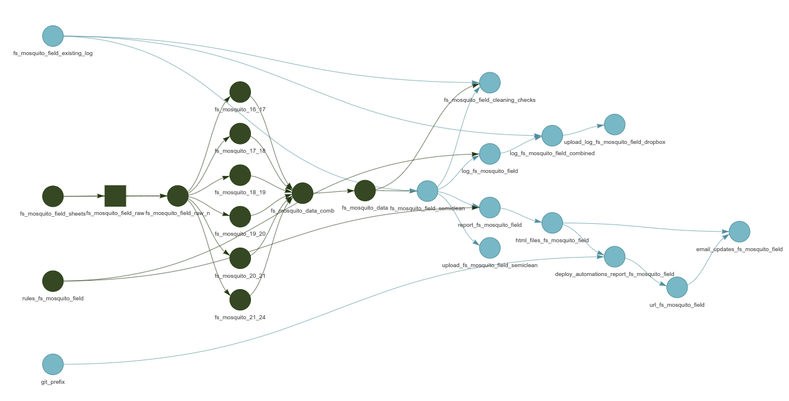

```{r, include = FALSE}
knitr::opts_chunk$set(
  collapse = TRUE,
  comment = "#>"
)
```

```{r setup}
library(ohcleandat)
```

This is a basic overview of the data cleaning and validation pipeline supported by {ohcleandat} functions. The pipeline is a data analytics workflow implemented in R, using the {targets} package. 

In a simple case, this has four steps: 

1. Reading in the data.  
2. Setting up rules to validate the data.  
3. The creation and use of a validation log.
4. Integrating the corrections of that log to clean the data. 

## Data Cleaning and Validation Pipeline  

### Reading raw data  
The raw data for this pipeline can be from a variety of sources. The first step is to read in this data, standardize it using some pre-processing steps and if required, combine it into one unified data set for review.

### Validation Rules  
Data validation rules are formally defined using the {validate} R package. These rules might involve ensuring the data is within a certain range, ensuring values are from a given input list or checking to see if values are unique or missing.

### Validation Log  
Once these rules have been defined, they are 'confronted' with the data. Those records that do not pass the validation checks are exported in a validation log. A validation log is a CSV output that can be sent to subject-matter experts for manual review. During the review process, the reviewer will indicate if an entry is valid or not, and if not, they will provide a 'new value' to be corrected as well as any optional comments.  

### Integrating corrections

The final step involves correcting the data and converting it into a 'semi-clean' data set. This involves reading in the validation log, scanning for any changes that are indicated, and then correcting the existing values with the newly supplied values.   

A conceptual overview of this process is outlined below.  


## Targets Implementation 

### Pipeline  

```{r, eval=FALSE}
fs_mosquito_field_targets <- tar_plan(
  # FS mosquito field data googlesheets ids
  targets::tar_target(
    fs_mosquito_field_sheets,
    c(
      fs_mosquito_21_24 = "1I45IcVtYi7hOc-qum7d",
      fs_mosquito_19_20 = "17hYyE_Rs4Z9IU-vpKTj",
      fs_mosquito_20_21 = "1qn_N0WVTKpwv0iKzOEm",
      fs_mosquito_16_17 = "1XAItM-YST8ZdUCU1gPH",
      fs_mosquito_17_18 = "1GUYgEX-VA0NH2_Yko-M",
      fs_mosquito_18_19 = "1HJv9-DOQ3sOgy3wVHoz"
    )
  ),
  
  # FS mosquito field data 2021-2024
  targets::tar_target(
    fs_mosquito_field_raw,
    ohcleandat::read_googlesheets(
      key_path = here::here("./key.json"),
      ss = fs_mosquito_field_sheets,
      sheet = "all"
    ),
    pattern = map(fs_mosquito_field_sheets),
    iteration = "list",
    cue = tar_cue("never")
  ),
  
  # setting intuitive names for the dynamic branches of each year
  tar_target(
    fs_mosquito_field_raw_n,
    set_names(fs_mosquito_field_raw, names(fs_mosquito_field_sheets))
  ),
  
  # clean data
  targets::tar_target(
    fs_mosquito_21_24,
    map_dfr(
      fs_mosquito_field_raw_n$fs_mosquito_21_24[1:5],
      clean_fs_mosquito_21_24
    )
  ),
  
  targets::tar_target(
    fs_mosquito_19_20,
    map_dfr(
      fs_mosquito_field_raw_n$fs_mosquito_19_20[1:5],
      clean_fs_mosquito_19_20
    )
  ),
  
  targets::tar_target(
    fs_mosquito_20_21,
    map_dfr(
      fs_mosquito_field_raw_n$fs_mosquito_20_21[-5],
      clean_fs_mosquito_20_21
    )
  ),
  
  targets::tar_target(
    fs_mosquito_16_17,
    map_dfr(
      fs_mosquito_field_raw_n$fs_mosquito_16_17[-c(3, 24, 25)],
      clean_fs_mosquito_16_17
    )
  ),
  
  targets::tar_target(
    fs_mosquito_17_18,
    map_dfr(
      fs_mosquito_field_raw_n$fs_mosquito_17_18,
      clean_fs_mosquito_17_18
    )
  ),
  
  targets::tar_target(
    fs_mosquito_18_19,
    map_dfr(
      fs_mosquito_field_raw_n$fs_mosquito_18_19[1:23],
      clean_fs_mosquito_18_19
    )
  ),
  
  # combine all years
  targets::tar_target(
    fs_mosquito_data_comb,
    bind_rows(
      fs_mosquito_21_24 = fs_mosquito_21_24,
      fs_mosquito_19_20 = fs_mosquito_19_20,
      fs_mosquito_20_21 = fs_mosquito_20_21,
      fs_mosquito_16_17 = fs_mosquito_16_17,
      fs_mosquito_17_18 = fs_mosquito_17_18,
      fs_mosquito_18_19 = fs_mosquito_18_19,
      .id = "dataset"
    )
  ),
  
  # post processing
  targets::tar_target(
    fs_mosquito_data,
    combine_fs_mosquito_field(fs_mosquito_data_comb)
  ),
  
  # read in existing validation log if exists
  targets::tar_target(
    fs_mosquito_field_existing_log,
    ohcleandat::get_dropbox_val_logs(
      file_name = "log_fs_mosquito_field.csv",
      path_name = "dropbox/validation_logs",
      folder = NULL
    ),
    cue = targets::tar_cue("always")
  ),
  
  # clean the data using the existing validation log
  targets::tar_target(
    fs_mosquito_field_semiclean,
    ohcleandat::correct_data(
      validation_log = fs_mosquito_field_existing_log,
      data = fs_mosquito_data,
      primary_key = "key"
    )
  ),
  
  #   # validation cleaning checks
  targets::tar_target(
    fs_mosquito_field_cleaning_checks,
    ohcleandat::validation_checks(
      validation_log = fs_mosquito_field_existing_log,
      before_data = fs_mosquito_data,
      after_data = fs_mosquito_field_semiclean
    )
  ),
  
  # upload semiclean data
  targets::tar_target(
    upload_fs_mosquito_field_semiclean,
    ohcleandat::dropbox_upload(
      fs_mosquito_field_semiclean,
      file_path = here::here("outputs/semiclean_fs_mosquito_field.csv"),
      dropbox_path = "dropbox/semi_clean_data"
    ),
    cue = targets::tar_cue("always")
  ),
  
  # Initializing rules which are defined as a function
  targets::tar_target(rules_fs_mosquito_field, create_rules_fs_mosquito_field()),
  
  # mapping through rules to create a validation log
  targets::tar_target(
    log_fs_mosquito_field,
    map_df(
      rules_fs_mosquito_field[-c(13, 14)],
      ~ ohcleandat::create_validation_log(
        data = fs_mosquito_field_semiclean,
        rule_set = .x,
        pkey = "key"
      )
    )
  ),
  
  # Combine new validation violations with existing log
  targets::tar_target(
    log_fs_mosquito_field_combined,
    ohcleandat::combine_logs(existing_log = fs_mosquito_field_existing_log, new_log = log_fs_mosquito_field)
  ),
  
  # uploading to dropbox
  targets::tar_target(
    upload_log_fs_mosquito_field_dropbox,
    ohcleandat::dropbox_upload(
      log = log_fs_mosquito_field_combined,
      file_path = here::here("outputs/log_fs_mosquito_field.csv"),
      dropbox_path = "dropbpx/validation_logs"
    ),
    cue = targets::tar_cue("always")
  ),
  
  # Rendering a HTML report for archival and emailing
  tarchetypes::tar_render(
    report_fs_mosquito_field,
    path = here::here("reports/RVF2_FS_Mosquito_Field.Rmd"),
    output_dir = "outputs",
    knit_root_dir = here::here()
  ),
  
  # target to identify report path
  targets::tar_target(
    html_files_fs_mosquito_field,
    containerTemplateUtils::get_file_paths(report_fs_mosquito_field, pattern = "\\.html$")
  ),
  
  # Upload and archive report to AWS S3
  targets::tar_target(
    deploy_automations_report_fs_mosquito_field,
    containerTemplateUtils::aws_s3_upload(
      path = html_files_fs_mosquito_field,
      prefix = sprintf("%s%s/", git_prefix, Sys.Date()),
      bucket = Sys.getenv("AWS_BUCKET"),
      error = TRUE,
      file_type = "html"
    ),
    cue = targets::tar_cue("always")
  ),
  
  # Create a custom URL for hyperlink
  targets::tar_target(
    url_fs_mosquito_field,
    ohcleandat::make_report_urls(deploy_automations_report_fs_mosquito_field)
  ),
  
  # Blast out email
  targets::tar_target(
    name = email_updates_fs_mosquito_field,
    command =
      containerTemplateUtils::send_email_update_tar(
        to = strsplit(Sys.getenv("EMAIL_RECIPIENTS_TEST"), ";")[[1]],
        from = Sys.getenv("EMAIL_SENDER"),
        project_name = "RVF1 & RVF2 FS Mosquito Field data",
        attach = TRUE,
        attachment_paths = html_files_fs_mosquito_field,
        use_hyperlinks = TRUE,
        hyperlinks_text = "Archived Report",
        hyperlinks_url = url_fs_mosquito_field,
        test = TRUE
      ),
    cue = targets::tar_cue("always")
  )
)

```

### DAG  
A directed acyclic graph of a {targets} pipeline is shown below for a real example. 



## Complex Cases  

In some cases, such as with questionnaire data, multiple different logs are created
and combined together - increasing the complexity.  

Below is an example of combining multiple log types together:  

```{r, eval=FALSE}
# mapping through rules to create a validation log
targets::tar_target(
  log_animal_owner,
  map_df(
    rules_animal_owner,
    ~ ohcleandat::create_questionnaire_log(
      data = animal_owner_semiclean,
      form_schema = animal_owner_schema,
      rule_set = .x,
      url = "https://odk.xyz.io/#/projects/5/forms/survey/submissions",
      pkey = "id"
    )
  )
),

# create validation log records for free text requiring translation
targets::tar_target(
  animal_owner_translation_log,
  ohcleandat::create_translation_log(
    response_data = animal_owner_semiclean,
    form_schema = animal_owner_schema,
    url = "https://odk.xyz.io/#/projects/5/forms/survey/submissions",
  )
),

# create validation log records for free text 'other' responses that may contain valid multi-options
targets::tar_target(
  animal_owner_text_log,
  ohcleandat::create_freetext_log(
    response_data = animal_owner_semiclean,
    form_schema = animal_owner_schema,
    url = "https://odk.xyz.io/#/projects/5/forms/survey/submissions",
    ,
    questionnaire = "animal_owner"
  )
  
),

# unite current-run logs
targets::tar_target(
  logs_all_animal_owner,
  bind_rows(
    log_animal_owner,
    animal_owner_translation_log,
    animal_owner_text_log
  )
),

# Combine new validation violations with existing log
targets::tar_target(
  log_animal_owner_combined,
  ohcleandat::combine_logs(existing_log = animal_owner_existing_log, new_log = logs_all_animal_owner)
)
```

## More info 
For more info on using {targets} see here: https://ecohealthalliance.github.io/eha-ma-handbook/3-projects.html#targets
