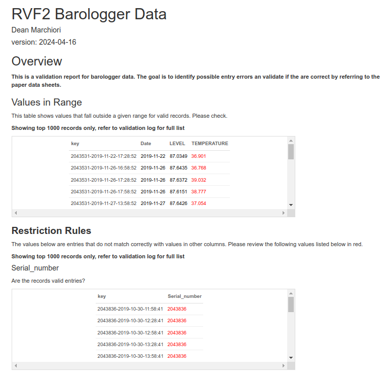

```{r, include = FALSE}
knitr::opts_chunk$set(
  collapse = TRUE,
  comment = "#>"
)
```

```{r setup}
library(ohcleandat)
```

The outputs of the data cleaning and validation pipeline are principally two objects. 

1. a HTML report that describes the quality checks that have been performed and highlights records that did not pass the validation checks. This provides an alert to users and is automatically emailed to a predefined email list.

2. A validation log. The validation log is a CSV output that is uploaded to a Dropbox location. This validation log provides a list of records with a field identifier and value that did not pass the validation checks. This is to be provided to subject matter experts to populate new values and confirm the updates to the data. The data cleaning and validation pipeline will scan for and apply changes that are indicated in the validation logs and correct the raw data.  

## HTML Report  

A sample HTML report is shows below. These are archived in AWS S3 and a secure link is produced. These details are emailed to a user on a pre-defined list of recipients.  



## Validation Logs

The following is a list of fields in the validation logs and their meaning:

**rowid**: Provides the correct order of entries in the validation log. This is important as users may choose to filter and change the order of the log in order to understand and appropriately correct records in the log. However, since changes need to be processed in sequential order, the rowid is used so that the correction functions in the data pipeline can appropriately process and correct changes to the data in the right order.

**log_response_id**: In some cases, a unique identifier for a record is a long and complicated ID string, which is not easily parsed by a human. To provide an easier way to filter and understand how different entries in the log relate to the same record, a simpler log_response_id provides just the group ID of a particular unique record for an identifier to understand how records relate to each other.

**entry**: This is the unique identifier for a particular record in the data. Otherwise known as the primary key. This is the key identifier that is used to locate the record in the data and apply corrections. 

**field**: This is the column name in the data set relating to the record that is being described in the validation log. 

**question**: The question column exists for survey data only and provides the survey question text.   

**issue**: A human readable description of which validation rule has been broken and what needs to be corrected. 

**old_value**: Indicates the current value in the data that did not pass the validation rule.

**is_valid**: A very important column in the validation log. This can take two values. TRUE or FALSE (also acceptable are T and F). When a particular record in the validation log needs to be corrected a user must mark this with FALSE, indicating the current value in the data set is not valid and that it requires correction. If a user is reviewing the validation log and despite the fact that there has been an entry in the log, the old value in the data is in fact correct, the user can place a TRUE in this field to indicate that the record is valid and does not require correction.  

**new_val**: A column for human input to indicate the corrected value.  

**overwrite_old_value**: For survey or questionnaire data only, this column has two options, TRUE or FALSE. This will indicate whether the new value should completely overwrite the old value that is currently in the data. If this is set to FALSE, the new value will be appended to the end of the old_value string.

**user_initials**: This enables the reviewer to provide their initials so we understand which reviewer has made the corrections in the log. 

**odk_url**: For survey data this field is present to provide the reviewer with a way to go back and view the original ODK submission in order to gain further context around the particular question and its value.

**comments**: Can contain system generated or user provided comments to assist with understanding why changes were made.  

It's important that the formatting and file format of the validation log is not changed. As this data set needs to be machine readable and is used directly to apply changes to the data.

### Special Cases 

There are some special cases where the validation log can be used to do more than just simply correcting existing values that are raised. 

The first example of this is **creating a new value** in the data set. If a new value is to be created the user must go to the end of the validation log and create a new entry. A new `rowid` should be provided and the appropriate entry ID should be populated. The fields `new_value` and `is_valid` columns also need to be created.

In the case where **a record is to be deleted**, a user can provide a keyword in the `new_val` column. Currently, this keyword is 'Delete'. This is set to be detected in the pipeline and rather than changing the value to the word 'Delete' the correction function will interpret this as an instruction to delete this particular record from the data. If this keyword needs to be changed, there is the ability to pass this argument to the correction function, in the targets pipeline.  
